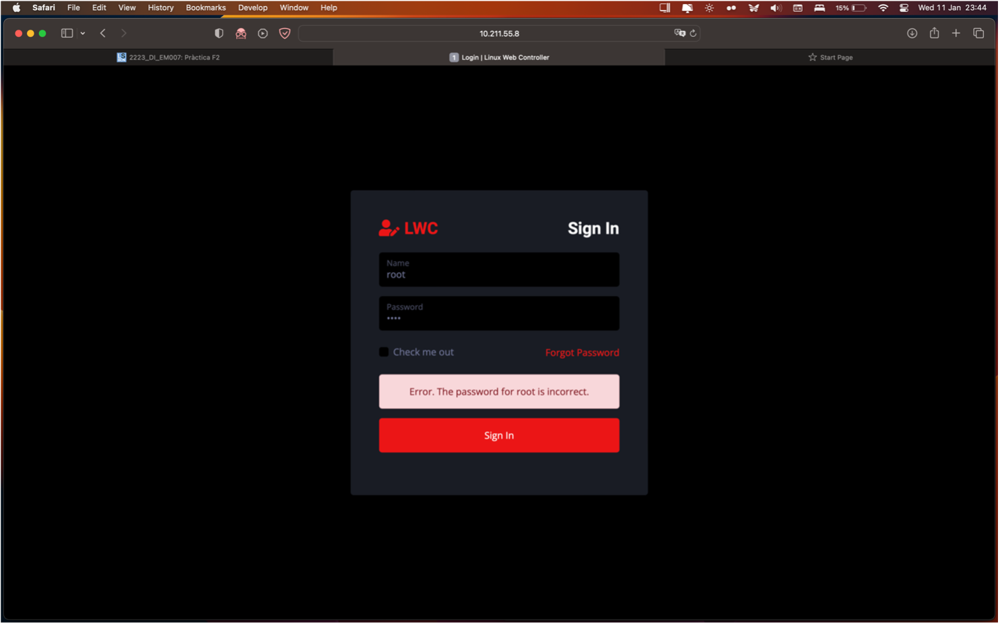
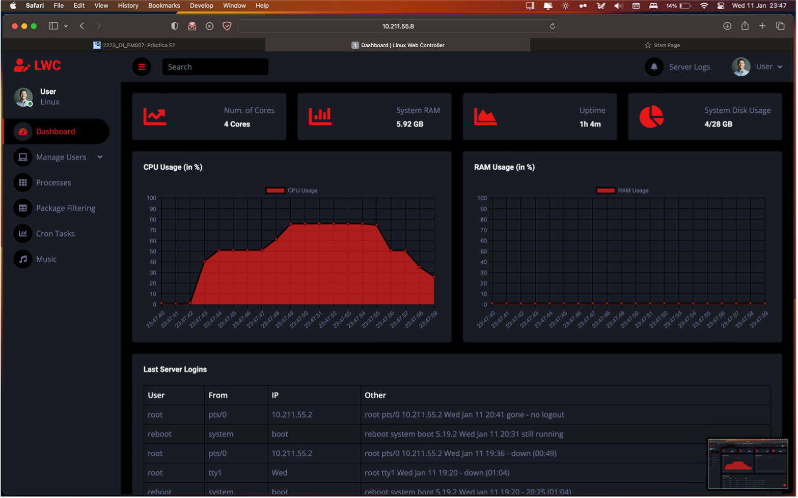
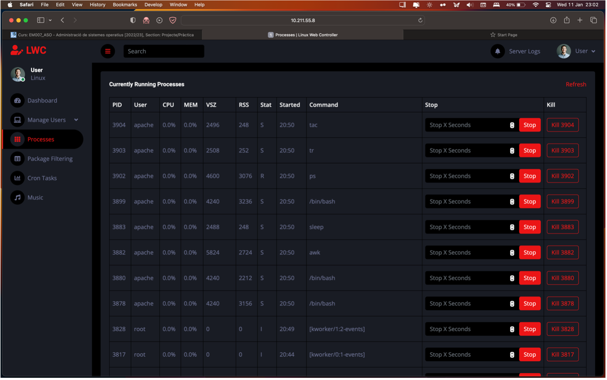
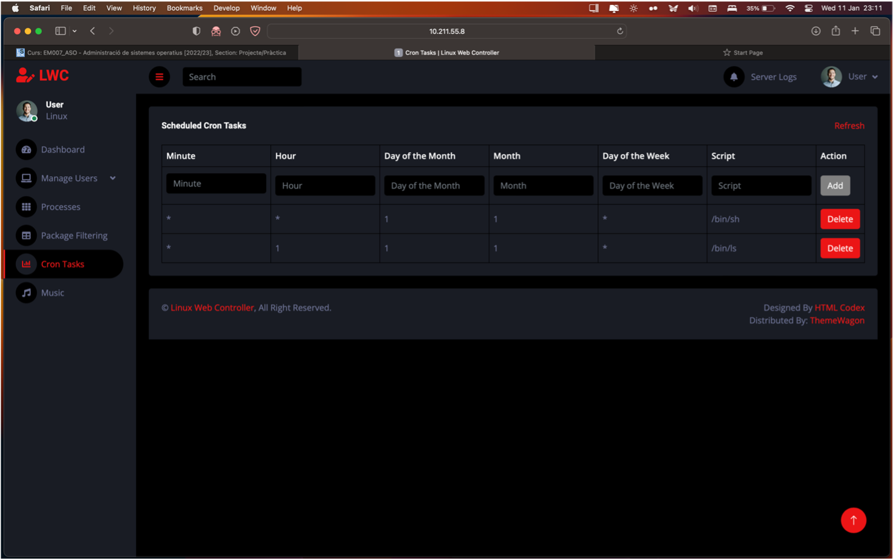
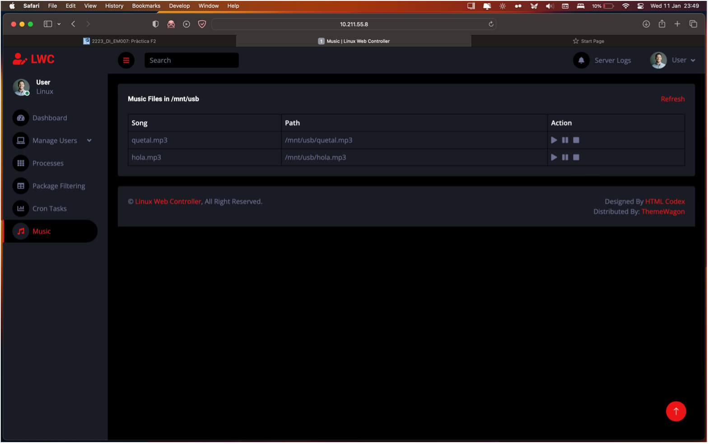

<p align="center" style="margin-top: 50px">
  
</p>

<h1 align="center">Linux Web Controller</h1>

<p align="center">
  <a href="https://en.wikipedia.org/wiki/Bash_(Unix_shell)">
    
  </a>
  <a href="https://github.com/bielcarpi/linux-web-controller">
    
  </a>
    <a href="https://opensource.org/licenses/BSD-3-Clause">
    
  </a>
</p>

<p align="center">
    Control your Linux OS from the web with Linux Web Controller (using Apache in your machine). 
    It allows you to see CPU and MEM usage, create cron tasks, see processes running, shutdown the machine, etc.
</p>

## Screenshots

### Login


### Dashboard - Monitor your system


### Control Processes


### Set Up Cron Tasks


### Automount USB Devices with Music


## How To Use
```bash
# Install & Configure Apache on your Linux distro

# Clone this project inside the directory where you'll serve from Apache
$ git clone https://github.com/bielcarpi/linux-web-controller.git

# Configure Apache for executing cgi/sh scripts in the directory cgi-bin

# Start Apache and control your system from the Web
```

## Authors
Guillem Godoy (guillem.godoy@students.salle.url.edu)
<br>
Biel Carpi (biel.carpi@students.salle.url.edu)